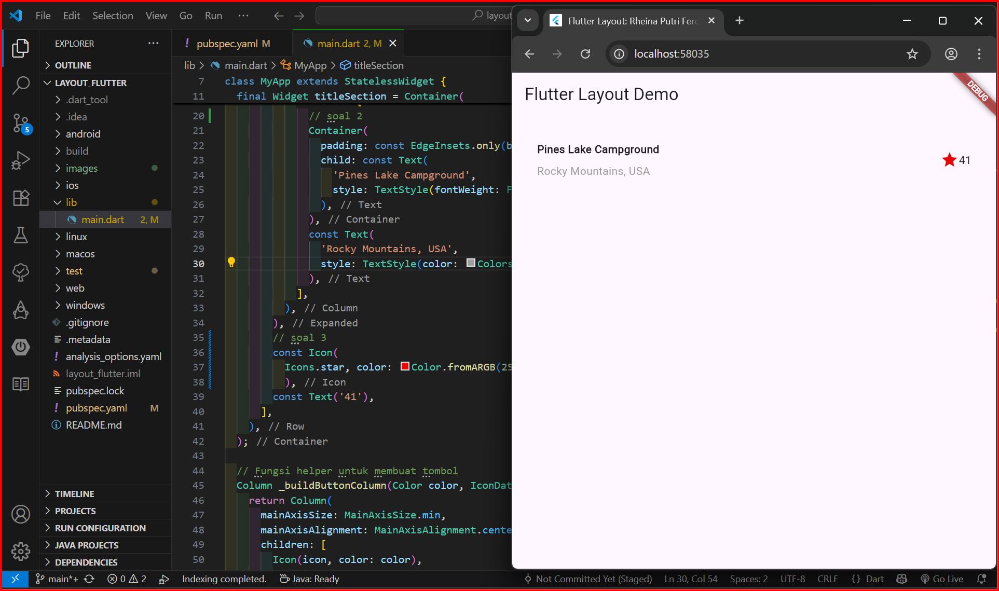
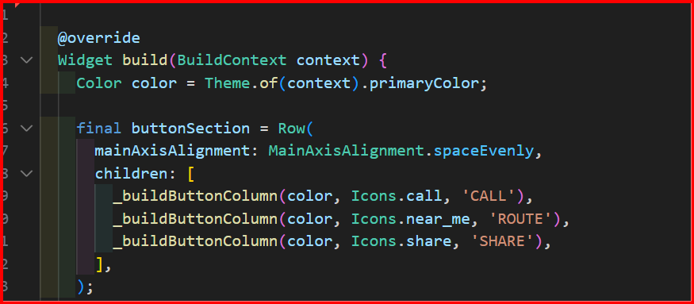
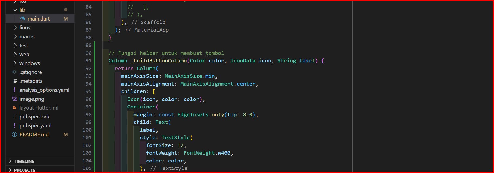
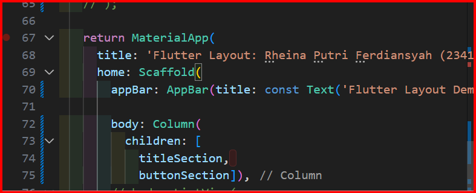
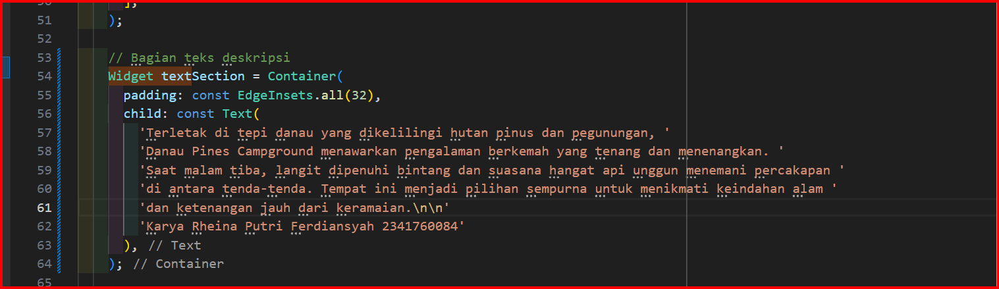
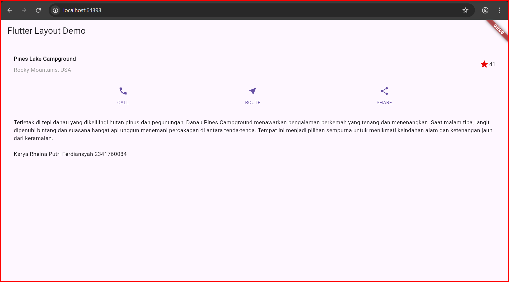
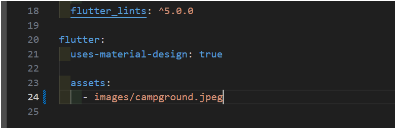
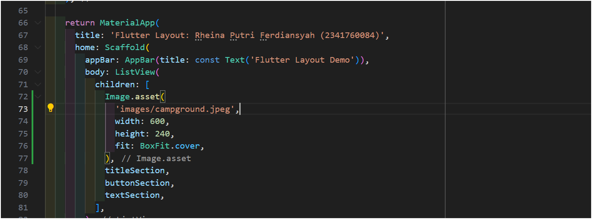
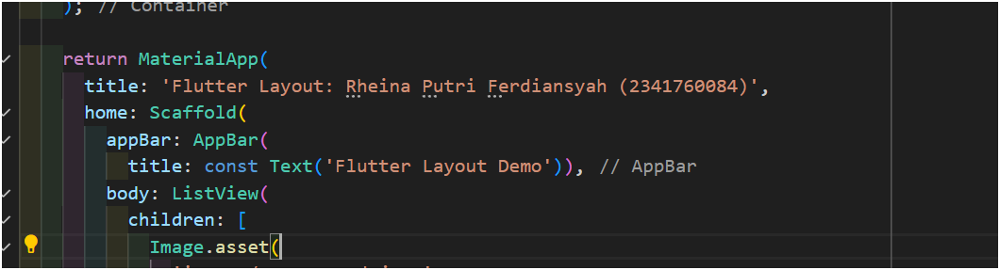

# layout_flutter

Nama : Rheina Putri Ferdiansyah
NIM  : 2341760084

A new Flutter project.

Praktikum 1 : Membangun Layout di Flutter
- Soal 1: Meletakkan widget Column di dalam Expanded agar menyesuaikan ruang yang tersisa di dalam Row. Menambahkan properti crossAxisAlignment: CrossAxisAlignment.start supaya isi kolom rata ke kiri.
- Soal 2: Menempatkan teks pertama di dalam Container dengan padding bawah sebesar 8.0 dan menambahkan teks lokasi ‘Rocky Mountains, USA’ dengan warna abu-abu menggunakan TextStyle(color: Colors.grey).
- Soal 3: Menambahkan ikon bintang (Icons.star) berwarna merah (Color.fromARGB(255, 231, 6, 6)) dan teks ‘41’ di bagian akhir baris. Seluruh bagian judul dibungkus dalam Container dengan padding sebesar 32.0 di setiap sisi.

- Mengganti isi body teks ‘Hello World’ dengan variabel titleSection agar layout menampilkan bagian judul tersebut di tampilan utama.

Praktikum 2 : Implementasi button row
- Membuat method _buildButtonColumn() sebagai fungsi pembantu untuk membangun tiga tombol dengan tata letak seragam.

-Langkah 2: Buat widget buttonSection

- Method ini menerima parameter Color, IconData, dan String untuk menentukan warna, ikon, serta label teks.
- Mengembalikan widget Column yang berisi ikon di atas teks dengan gaya dan warna sesuai parameter.

Langkah 3: Tambah button section ke body
- Digunakan pada buttonSection untuk menampilkan tiga tombol: CALL, ROUTE, dan SHARE dengan jarak yang merata.

Hasil : 

### Praktikum 3: Implementasi text section
Langkah 1: Buat widget textSection
- Membuat variabel textSection berisi teks dalamContainer dengan padding.
- Menambahkan softWrap: true agar teks otomatis membungkus.
- Diletakkan di bawah buttonSection.

Langkah 2: Tambahkan variabel text section ke body

Hasil : 

### Praktikum 4: Implementasi image section

Langkah 1: Siapkan aset gambar
- Membuat folder images di root project layout_flutter.
- Menambahkan file gambar (campground.jpg) ke folder tersebut.
- Mendaftarkan gambar di pubspec.yaml di bawah bagian assets: dengan indentasi yang benar.
- Memastikan huruf besar–kecil sesuai dan merestart program agar perubahan diterapkan.

Langkah 2: Tambahkan gambar ke body

- Menambahkan aset gambar ke dalam body menggunakan Image.asset().
- Memberi properti fit: BoxFit.cover agar gambar menutupi seluruh area tampilan secara proporsional tanpa terpotong.

Langkah 3: Terakhir, ubah menjadi ListView
- Menempatkan semua elemen dalam ListView agar tampilan bisa di-scroll.

